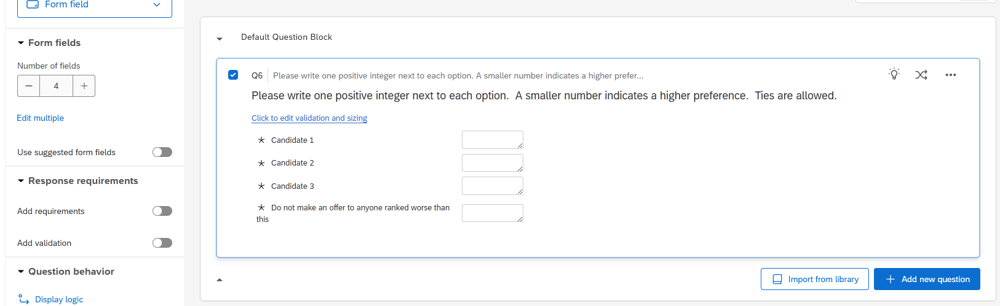

# Ranked Pairs Voting for Faculty Hiring

This document explains how the department uses ranked-choice voting to make hiring decisions, and how to run the script that tallies the votes.

## The Problem We're Solving

When the department votes on candidates (e.g., who to invite for on-campus interviews, or who to make an offer to), we want a fair method that:

1. Lets everyone express their full preferences, not just their top choice
2. Finds a winner that the majority prefers, when one exists
3. Produces a complete ranking, not just a winner (useful for backup candidates)
4. Handles ties transparently

Simple "pick your favorite" voting can produce bad outcomes when there are more than two candidates. For example, if 60% of voters prefer candidates A or B over C, but they split evenly between A and B, then C could win with only 40% support.

## How the Voting Works

### Step 1: Create the Qualtrics Survey

Set up a Qualtrics survey with a single question listing all candidates. Use the "Form field" question type, with one text field per candidate where voters enter a positive integer (1 = top choice, 2 = second choice, etc.).



Voters can:
- Give different candidates the same number (a tie in their personal ranking)
- Skip candidates they don't want to rank
- Include a "Do not hire" option as a threshold

### Step 2: Collect Votes

Send the survey link to eligible voters. The survey is anonymous.

### Step 3: Export from Qualtrics

1. Go to **Data & Analysis** in your Qualtrics survey
2. Click **Export & Import** → **Export Data**
3. Choose **CSV** format
4. Download and save the file

### Step 4: Run the App

**Option A: Desktop App (recommended)**

Double-click `RankedPairsVoting.exe` to launch the graphical interface:
1. Click "Select Ballot CSV" and choose your exported file
2. Click "Run Ranked Pairs"
3. Results are saved to the same folder as your CSV

**Option B: Command Line**

```
python ranked_pairs_voting.py your-ballots.csv --verbose
```

Either method produces:
- `survey-results YYYY-MM-DD.xlsx` - Results spreadsheet
- `resolved-ranking.pdf` - Visual showing the final ranking
- `head-to-head-results.pdf` - Visual showing all pairwise victories

## Understanding the Method

### Ranked Pairs (Tideman Method)

The script uses the **Ranked Pairs** method, developed by Nicolaus Tideman. Here's how it works in plain English:

1. **Compare every pair of candidates.** For each pair (A vs B), count how many voters ranked A above B, and vice versa. The one with more votes "wins" that matchup.

2. **Sort the matchups by margin.** A matchup where A beats B by 15-3 is "stronger" than one where C beats D by 9-7.

3. **Lock in results, strongest first.** Starting with the strongest matchup, we "lock in" results to build a ranking. But we skip any result that would create a contradiction (a cycle like A > B > C > A).

4. **The final ranking is the result.** Once all matchups are processed, we have a complete ordering.

### Why This Method?

- **Condorcet winner:** If one candidate would beat every other candidate head-to-head, they're guaranteed to win. This is the most intuitive notion of "majority preference."

- **No vote splitting:** Unlike simple plurality voting, similar candidates don't hurt each other.

- **Complete ranking:** We get 1st, 2nd, 3rd, etc., which is useful when top candidates decline offers.

### Borda Scores

The spreadsheet also shows "Borda scores" for each candidate. This is simpler: for each pair of candidates, we add up (wins minus losses) across all matchups. It's what the department used historically and serves as a sanity check.

Usually Ranked Pairs and Borda agree. When they differ, Ranked Pairs is generally considered more theoretically sound.

## Understanding the Output

### The Excel File

**Results sheet:**
| Candidate | Ranked Pairs Rank | Borda Score |
|-----------|-------------------|-------------|
| Smith     | 1                 | +24         |
| Jones     | 2                 | +12         |
| ...       | ...               | ...         |

- **Ranked Pairs Rank:** The final ordering (1 = winner)
- **Borda Score:** Sum of pairwise margins (higher = better)

**Matchups sheet:**

A matrix showing head-to-head margins. Entry (A, B) shows how many more voters preferred A over B than B over A. Positive means A is preferred.

**Notes sheet:**

Warnings about ties requiring chair intervention, or ballots with missing votes.

### The Graphs

**head-to-head-results.pdf:**
- Shows all pairwise victories
- An arrow from A to B means A beat B head-to-head
- This graph can contain cycles (A beats B, B beats C, C beats A) when there's no clear Condorcet winner

**resolved-ranking.pdf:**
- The final ranking after applying the Ranked Pairs algorithm
- Conflicting edges that would create cycles are removed, leaving a clean top-to-bottom ordering
- This is the official result
- If there are ties, the title will say "CHAIR REVIEW NEEDED"

When there are no cycles, both graphs look similar. When cycles exist (ties), comparing the two shows which victories were "overruled" to produce a consistent ranking.

## When There Are Ties

Sometimes the method cannot produce a complete ranking. This happens when:
- Two candidates have identical support
- There's a rock-paper-scissors situation (A > B > C > A)

When this happens:
1. The script flags it clearly
2. The spreadsheet shows approximate rankings with "~" prefix
3. The graphs show where the ambiguity is
4. **The chair reviews the graph and makes the final call**

The chair should look at the graph and choose any ordering that's consistent with the arrows shown. The algorithm has already resolved everything it can - the remaining ambiguity represents genuine ties in voter preferences.

This tie-breaking approach was developed by George Gilbert.

## Handling Edge Cases

### Missing Votes

If a voter leaves some candidates unranked:
- By default, those candidates are treated as "no preference" for that voter
- They don't count as wins or losses against other candidates
- Use `--missing-votes worst` to treat unranked candidates as worst choice

### The "Do Not Hire" Option

Include this as a candidate. If it ranks above a real candidate, that's a signal that the department prefers not hiring to hiring that person.

## Quick Reference

**To run the script:**
```
python ranked_pairs_voting.py ballots.csv --verbose
```

**Options:**
- `--verbose` or `-v`: Show progress information
- `--output FOLDER`: Save results to a different folder
- `--missing-votes skip|worst|error`: How to handle missing votes

**Requirements for .exe:**
- None! The executable includes everything needed.

**Requirements for Python script:**
- Python 3.9+
- pandas, networkx, openpyxl, graphviz
- Graphviz installed on system (for PDF graph output)

## Building the Executable

To rebuild the standalone `.exe` (for developers):

1. Ensure Python and pip are installed
2. Run `build_exe_flet.bat`
3. The executable will be created in the `dist` folder

---

*For more on Ranked Pairs: [Wikipedia](https://en.wikipedia.org/wiki/Ranked_pairs)*

*For the mathematical details, see AlgorithmProposalGTG1.pdf.*
