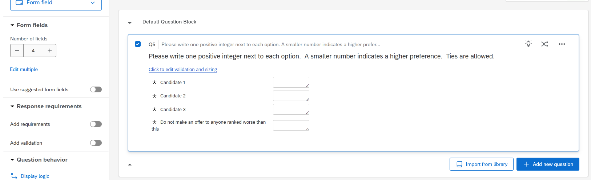

# Ranked Pairs Voting

This document describes how the department uses ranked-choice voting and how to run the script that tallies the votes. Hiring decisions are the most common use (who to invite for on-campus interviews, who to make an offer to), but the same method works for any departmental vote with more than two options.

## Running a vote

### Step 1: Create the Qualtrics survey

Set up a Qualtrics survey with a single question listing all options. Use the "Form field" question type, with one text field per option where voters enter a positive integer (1 = top choice, 2 = second choice, etc.).



Voters can give different options the same number (a tie in their personal ranking), skip options they don't want to rank, and use a threshold option (e.g. "Do not hire", "None of the above") to indicate that anything ranked below it is unacceptable.

### Step 2: Configure security settings

To ensure each faculty member can vote only once while keeping votes anonymous (even from you):

1. **Enable Invitation-Only Access:**
   - Go to **Survey** → **Survey Options** (icon on the left) → **Security**
   - Set **Survey Access** to **"Invitation only"**
   - Enable **"Prevent multiple submissions"**

2. **Enable Anonymization:**
   - In the same Security tab, enable **"Anonymize responses"**
   - This disconnects responses from contact records

References:
- [Qualtrics: Security Survey Options](https://www.qualtrics.com/support/survey-platform/survey-module/survey-options/survey-protection/)
- [Qualtrics: Anonymize Responses](https://www.qualtrics.com/support/survey-platform/sp-administration/data-privacy-tab/anonymous-responses-admin/)

### Step 3: Collect votes

1. Go to **Distributions** → **Emails** → **Compose Email**
2. Click **Select Contacts** in the recipient field
3. Create a new contact list (or select existing):
   - Click **New Contact List**
   - Name it (e.g., "2025 Instructor Hiring Vote: Zoom interviews")
   - Enter emails manually or import a CSV
4. Compose the invitation email
5. Click **Send**

Each voter receives a unique, one-time-use link. Reminders can be sent to non-respondents without exposing votes.

### Step 4: Export from Qualtrics

1. Go to **Data & Analysis** in the Qualtrics survey
2. Click **Export & Import** → **Export Data**
3. Choose **CSV** format
4. Select **"Export values"** (not "Export labels")
5. Download and save the file

### Step 5: Run the app

Double-click `RankedPairsVoting.exe` to launch the GUI: select the exported ballot CSV, click "Run Ranked Pairs", and results are saved to the same folder as the CSV. A sample ballot file `sample-ballots.csv` is included for testing.

Or, from the command line:

```
python ranked_pairs_voting.py your-ballots.csv --verbose
```

Either method produces a results spreadsheet (`survey-results YYYY-MM-DD.xlsx`), a final ranking graph (`resolved-ranking.pdf`), and a head-to-head graph (`head-to-head-results.pdf`).

## Method

The script uses Ranked Pairs (Tideman 1987):

1. **Compare every pair of candidates.** For each pair (A, B), count how many voters ranked A above B and vice versa. The one with more votes wins that matchup.

2. **Sort the matchups by margin.** A matchup where A beats B 15–3 is stronger than one where C beats D 9–7.

3. **Lock in results, strongest first.** Starting with the strongest matchup, lock in results to build a ranking, skipping any result that would create a cycle (A > B > C > A).

4. **The locked-in matchups give the final ranking.**

The method guarantees a Condorcet winner when one exists: if some candidate would beat every other candidate head-to-head, that candidate wins. It avoids vote-splitting between similar candidates, and it produces a complete ranking, which matters when top candidates decline offers.

## Output

### The Excel file

**Results sheet:**

| Candidate | Ranked Pairs Rank | Borda Score |
|-----------|-------------------|-------------|
| Smith     | 1                 | +24         |
| Jones     | 2                 | +12         |
| ...       | ...               | ...         |

The Ranked Pairs rank is the final ordering (1 = winner). The Borda score is the sum of pairwise margins across all matchups (wins minus losses); higher is better. Borda is what the department used historically and serves as a sanity check, but isn't as useful. Ranked Pairs and Borda usually agree; when they disagree, Ranked Pairs is the official result.

**Matchups sheet:** a matrix of head-to-head margins. Entry (A, B) shows how many more voters preferred A over B than B over A. Positive means A is preferred.

**Notes sheet:** warnings about ties requiring chair intervention, or ballots with missing votes.

### The graphs

`head-to-head-results.pdf` shows all pairwise victories: an arrow from A to B means A beat B head-to-head. This graph can contain cycles (A beats B, B beats C, C beats A) when there is no Condorcet winner.

`resolved-ranking.pdf` shows the final ranking after applying Ranked Pairs. Edges that would create cycles are removed, leaving a clean top-to-bottom ordering. This is the official result. If there are ties, the title says "CHAIR REVIEW NEEDED".

When there are no cycles the two graphs look similar. When cycles exist, comparing them shows which victories were overruled to produce a consistent ranking.

## Ties

Sometimes the method cannot produce a complete ranking: two candidates have identical support, or there's a rock-paper-scissors situation (A > B > C > A). When this happens the script flags it, the spreadsheet shows approximate rankings with a `~` prefix, and the graphs show where the ambiguity is. The chair then reviews the graph and chooses any ordering consistent with the arrows shown. The algorithm has already resolved everything it can; the remaining ambiguity is a genuine tie in voter preferences. (Tie-breaking procedure due to George Gilbert.)

## Edge cases

**Missing votes.** If a voter leaves some candidates unranked, those candidates are treated as "no preference" for that voter by default — they don't count as wins or losses against other candidates. Use `--missing-votes worst` to treat unranked candidates as the worst choice instead.

**Threshold options.** For hiring votes, include a "Do not hire" option; for other votes, something like "None of the above", as appropriate.

## Command-line options

- `--verbose`, `-v`: show progress information
- `--output FOLDER`: save results to a different folder
- `--missing-votes skip|worst|error`: how to handle missing votes

The Python script requires Python 3.9+, `pandas`, `networkx`, `openpyxl`, and `graphviz` (plus a system Graphviz install for PDF graph output). The `.exe` bundles everything.

## Building the executable

To rebuild the standalone `.exe`: ensure Python and pip are installed, run `build_exe_flet.bat`, and the executable will be created in the `dist` folder.

---

*For more on Ranked Pairs: [Wikipedia](https://en.wikipedia.org/wiki/Ranked_pairs). For the mathematical details, see `AlgorithmProposalGTG1.pdf`.*
